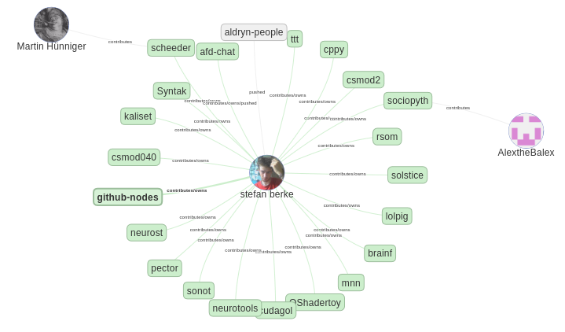

# Github nodes

Track connections between groups, people and repos on
github with python and javascript



Currently this is just a small python lib that interacts with the
github rest v3 api.
All results are cached in an mongoDB.

It's not using the GraphQL api, mainly because the results are harder to
cache. And the GraphQL api uses the REST api under the hood, anyways,
so i rather store **all** the rest results in cache and build the graph
from that.

*Throttling* is a problem. You can create a `github_credentials.py` in
the `githubapi` directory, containing:
```python
USERNAME = "github-user-login"
TOKEN = "api-token"
```

or give these credentials to the GithubClient instantiation,
which enables 5000 requests per hour. The GithubClient class will
throttle your requests to comply with githubs rate limits.

## visualization

The `create_html.py` is an example prog that creates a html/js website that
displays the nodes you are interested in using [vis.js](https://github.com/almende/vis).

## usage

The class `Github` does all the abstraction and caching of the github api.
It returns the raw json objects (including the `_id` from mongodb)

```python
gh = Github()
gh.get_user("username")
gh.get_repo_list("user-or-orgname")
gh.get_repo("username", "reponame")
gh.get_repo("username/reponame")
gh.get_events("user-or-orgname")
gh.get_organisation("orgname")
gh.get_organisation_members("orgname")
gh.get_repo_contributors("username/reponame")
# or for direct uncached access
gh.get_url("repos/user/reponame")
```

Users and organisations are quite the same in terms of returned data-structure.
Except that organisations can have members and that the rest *url*s
are different.

The `GithubNodes` class will automatically follow the connections between
all the known github objects. It does so by inspecting the particular
data attached to each encountered objects. Orgs have members,
repos have owners, ... Also the recent events are inferred for contributions.
Currently, if a fork is encountered, the source repository is used instead.

```python
gn = GithubNodes()
gn.add_organization("google", follow_depth=3)
```

Note that these things can really take **forever** for active
users or organisations.
(depth=1 already takes about 20 minutes in this example)

Also note that deactivating the cache for these *spidery* tasks is
not implemeneted well. The GithubNodes class will reinspect objects
quite often. If you want to have a fresh look at things, use
`Github.clear_cache()` beforehand to remove a document or whole
collection from cache.

Please also note that this is all pretty beta--if at all..

